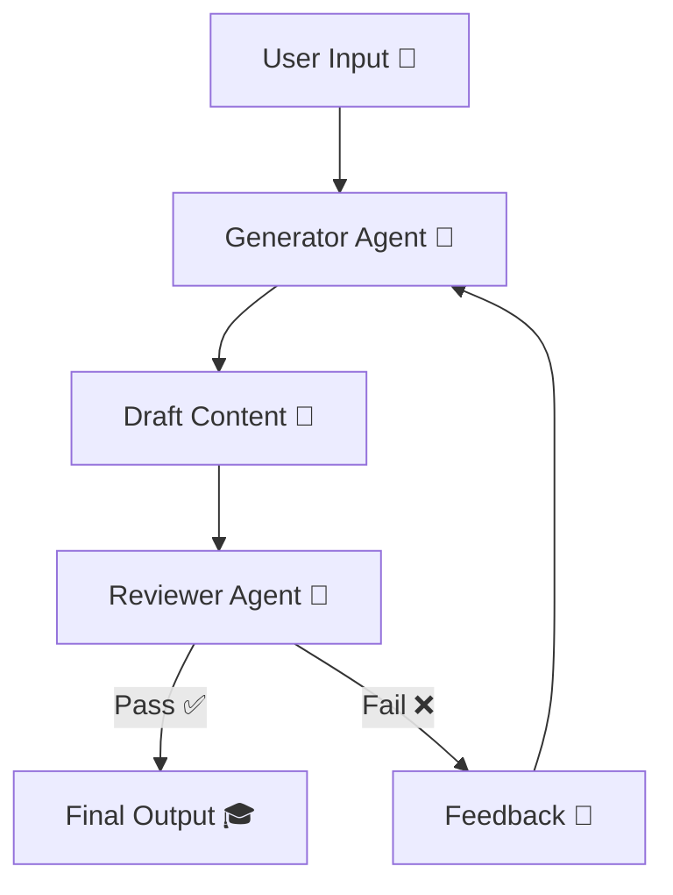

<h1 align="center">🤖 EduAgent AI</h1>
<h3 align="center">🎓 Autonomous Learning Content Engine</h3>

<p align="center">
  
  
  
  
</p>

<p align="center">
  <b>⚡ Generate • Evaluate • Improve — Fully Automated Learning System</b>
</p>

---

## 🎥 Demo — EduAgent in Action  

<p align="center">
  
</p>

<p align="center">
  <b>📚 AI creates → reviews → refines educational content in real-time</b>
</p>

---

## 🧠 What is EduAgent AI?

> A **self-improving AI agent system** that generates and validates educational content.

```
🎯 Input Topic
     ↓
🤖 Generator Agent
     ↓
🧐 Reviewer Agent
     ↓
🔁 Feedback Loop
     ↓
🎓 Final Learning Output
```

---

## ⚙️ Agent Intelligence Flow  



---

## 🤖 Core Agents  

| Agent | Role |
|------|------|
| 🤖 Generator | Creates explanations + MCQs |
| 🧐 Reviewer | Evaluates quality, clarity, correctness |
| 🔁 Refinement | Improves output using feedback |

---

## ⚡ Why EduAgent AI is Different  

✨ Not just generation → **evaluation + improvement**  
✨ Ensures **age-appropriate content**  
✨ Structured outputs (ready for apps / APIs)  
✨ Mimics real **teacher-review cycle**  

---

## 🧪 Example Output  

```
📘 Explanation:
Angles are formed when two lines meet...

❓ MCQs:
1. What is a right angle?
A. 90° ✅
B. 45°
C. 180°
D. 60°

🧐 Review Result:
✔ Language appropriate
✔ Concept correct

🎯 Final Status: PASS
```

---

## 🛠️ Tech Stack  

```
🐍 Python
⚡ Streamlit
🤖 Gemini API
📡 REST API
```

---

## 📂 Project Structure  

```
📁 EduAgent-AI
│── app.py
│── agent pipeline
│── logic modules
│── requirements.txt
```

---

## 🚀 Run Locally  

```bash
pip install -r requirements.txt
streamlit run app.py
```

---

## 🎯 Core Logic  

✔️ Generate structured learning content  
✔️ Validate using reviewer agent  
✔️ Auto-refine if quality fails  
✔️ Optimized single feedback loop  

---

## 🎓 Use Cases  

- 📚 Smart content generation  
- 🧠 AI tutors  
- 📝 Exam practice systems  
- 🎯 Adaptive learning platforms  

---

## 🔮 Future Scope  

🚀 Personalized student learning  
📊 Performance tracking dashboard  
🧠 Multi-agent collaboration  
🌐 Web deployment  

---

## 💡 Philosophy  

> “AI should not just teach —  
> it should verify understanding.”

---

<p align="center">
  🎓 EduAgent AI — Building the Future of Intelligent Learning
</p>
